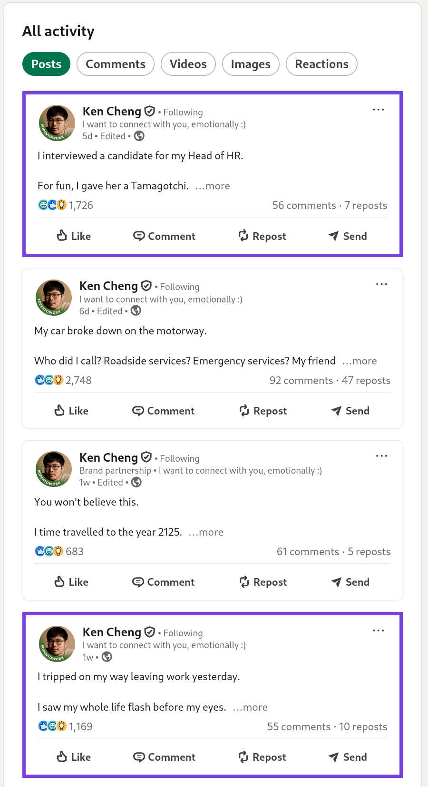

# LinkedIn Post Hider

Hide LinkedIn posts from your feed by using keywords and regex patterns. Designed to work in Firefox and Chrome.

## Screenshots

<table>
<tr>
<td>

**Settings dialog**

</td>
<td>

**Highlighting feature** (note: posts are _hidden_ rather than highlighted by default):

</td>
</tr>
<tr>
<td valign="top">

</td>
<td valign="top">

</td>
</tr>
</table>

## Installation

**1. Install the TamperMonkey extension**. Follow the instructions on the official website: https://www.tampermonkey.net/

In Chromium browsers, make sure that either "Allow User Scripts" or "Developer Mode" is enabled:
https://www.tampermonkey.net/faq.php#Q209

**2. Install this userscript by clicking [here](https://github.com/nukep/linkedin-post-hider/releases/latest/download/linkedin_post_hider.user.js)**. TamperMonkey will prompt you to install it.

- Alternative 1: Go to the latest release in this GitHub repo, download the JavaScript file, and copy its contents into a new TamperMonkey userscript.

## Limitations

This is a TamperMonkey userscript that requires a browser. As such, this does not work in the LinkedIn mobile app.

One way to use this on a mobile device is to use LinkedIn on Firefox Android, which allows add-ons such as TamperMonkey.
